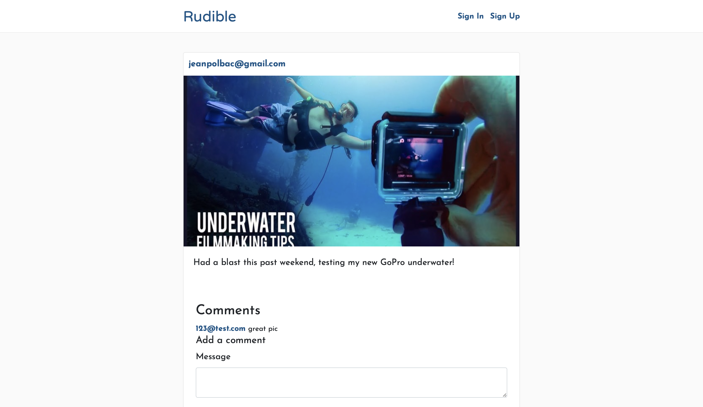

# Rudible - Test Driven Development

An Instagram clone that was built using industry-standard, test-driven development following numerous red/green/refactor cycles.

Preview:
https://rudi-jp-bacquet.herokuapp.com

## Features
* [Ruby on Rails](https://guides.rubyonrails.org/) - The web framework used
* Mobile-responsive
* Features a general feed of all pictures, as well as user-specific feeds.
* Users may edi and/or delete their posts, comments, and responses.

## Authors
* **Jean-Pol Bacquet** - *Assignment from UCF Web Boot Camp* - [Rudible - Test Driven Development](https://github.com/jeanpolbac/rudible-jp-bacquet

## Credits
* [UCF - Coding Bootcamp](https://bootcamp.ce.ucf.edu/coding/)
